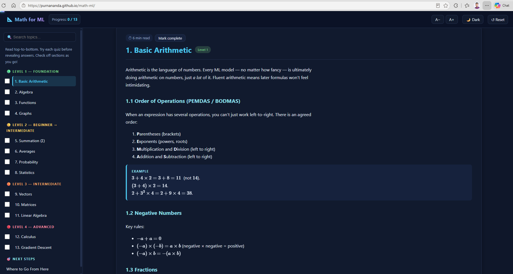

# math-ml

An interactive, single-page tutorial that teaches the **math you need for supervised machine learning** — from basic arithmetic all the way to gradient descent — with rendered equations, plain-English explanations, and a level-based roadmap.

🌐 **Live site:** <https://purnananda.github.io/math-ml/>

---

## ✨ What you'll get

- **13 lessons** organized into 4 progressive levels (Beginner → Advanced)
- **Live math rendering** for LaTeX-style equations
- **Dark / light theme** toggle
- **Sticky table of contents** with per-section navigation
- **Reading progress bar** so you always know how far you've come
- **Level badges** so you always know how deep you are

---

## 📚 Curriculum

### 🟢 Level 1 — Foundation
1. **Basic Arithmetic** — fractions, decimals, percentages, ratios, exponents, square roots
2. **Algebra** — variables, solving equations, rearranging formulas, linear & quadratic equations
3. **Functions** — inputs & outputs, linear & quadratic functions, graphing
4. **Graphs** — axes, coordinates, slope, straight lines, curves

### 🟡 Level 2 — Beginner → Intermediate
5. **Summation (Σ)** — sigma notation, summing sequences
6. **Averages** — mean, median, mode, weighted average
7. **Probability** — basic probability, independent events, conditional probability
8. **Statistics** — variance, standard deviation, normal distribution, outliers

### 🟠 Level 3 — Intermediate
9. **Vectors** — representation, addition, subtraction, magnitude, dot product
10. **Matrices** — matrix operations, multiplication, transpose, identity matrix
11. **Linear Algebra** — vector spaces, matrix operations, eigenvalues & eigenvectors

### 🔴 Level 4 — Advanced
12. **Calculus** — limits, derivatives, partial derivatives, chain rule
13. **Gradient Descent** — cost functions, gradients, learning rate, local vs. global minima

---

## 🎯 Why these topics?

Together, these lessons cover roughly **90–95%** of the math needed to follow supervised ML courses such as Andrew Ng's *Machine Learning Specialization*.

**Must-learn before starting supervised ML:**

✔ Basic Arithmetic &nbsp;•&nbsp; ✔ Algebra &nbsp;•&nbsp; ✔ Functions &nbsp;•&nbsp; ✔ Graphs
✔ Summation (Σ) &nbsp;•&nbsp; ✔ Mean & Average &nbsp;•&nbsp; ✔ Basic Statistics &nbsp;•&nbsp; ✔ Basic Probability
✔ Vectors &nbsp;•&nbsp; ✔ Matrices &nbsp;•&nbsp; ✔ Basic Derivatives &nbsp;•&nbsp; ✔ Gradient Descent

---

## 👥 Who is this for?

- Self-taught learners preparing for an ML course
- Students who want a **quick refresher** before diving into models
- Anyone who prefers **learning math in the context of ML** rather than in isolation

Start at Level 1 and work your way through. Good luck!
